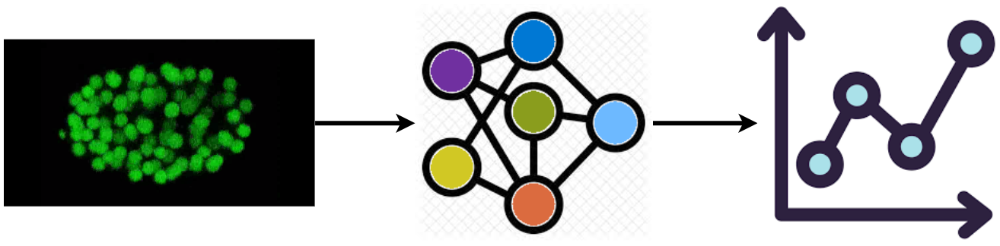
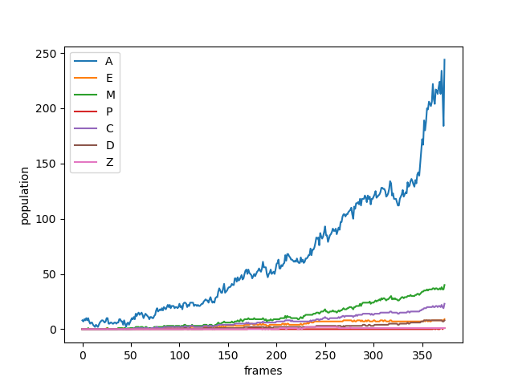

# pyelegans 



> Still under construction

## Importing a model for inferences 
```python
from pyelegans import lineage_population_model
```

 ## Loading a model instance to be used to estimate lineage populations of embryos from videos/photos.
```python
model = lineage_population_model(mode = "cpu")
```

## Making a prediction from an image
```python
pred = model.predict(image_path = "sample.png")
```

## Making predictions from a video and saving the predictions into a CSV file
```python
results = model.predict_from_video(video_path = "sample_videos/20090309_F39B2_1_7_L1.mov", save_csv = True, csv_name = "foo.csv")
```

## Plotting the model's predictions
```python
plot = model.create_population_plot_from_video(video_path = "sample_data/sample_videos/20090309_F39B2_1_7_L1.mov", save_plot= True, plot_name= "images/plot.png", ignore_last_n_frames= 30 )
plot.show()
```
This would show a plot like:


